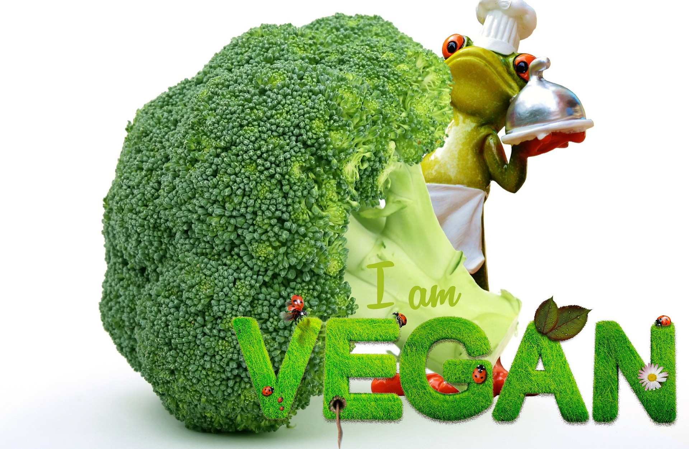

# Vegan-Awesome

Welcome to Vegan Awesome !!

## Table of contents

- [About the club](#about-the-club)
-[Mission](#mission)
-[Goals](#goals)
-[Activities](#activities)
-[How to get involved](#how-to-get-involved)
-[Contact Us](contact-us)

## About the club

The Vegan Awesome community is made up of individuals dedicated to spreading awareness about the benefits of a vegan lifestyle forboth personal health and the environment. We believe that every small action can contribute to a more sustainable and compassionate world.

## Mission

Our mission is to educate, inspire and empower individuals to make conscious decisions or choices that are in tune with a vegan lifestyle. We aim to build and nature a supportive community where people can learn about ethics, health and enviromentally related reasons for choosing and following a vegan lifestyle.

## Goals

- **Raise Awareness:** Through weekly group meetings and events we strive to inrease awareness about the impacts of using plastic as well as animal agriculture on the environment and advocate for cruelty-free practices.

-**Promote Education:** We provide resources , facts and research on veganism, helping people make informed decisions about their lifestyle choices.

-**Create a Community:** Our Community is a space where vegans and non-vegans can come together and share experiences, challenges, and success stories while promoting a sense of belonging.

## Activities

- **Yoga Sessions:** Join our weekly yoga sessions on Friday mornings so you can learn from our trained experts about the physical and mental benefits of incoporating yoga into your everyday life.

- **Beach clean up:** Come and tag along with some our community members in our weekly voluntary beach clean up exercises, make a positive impact on the environment. Saturday mornings.

- **Lunch meets:**  Join us for our weekly lunch get together on Sunday afternoon. This is an opportunity to try out different vegan or plantbased foods , share recipes, and simply grow a network of friends.

- **New Year Dinner/ Special Event:** This is our annually held Special Event where we encourage all existing and new members to come together for an event filled with fun activities including live music while we celebrate our community and the new Year celebrations

## How to get involved 

We welcome everyone, whether you are a longtime vegan, curious about the lifestyle, or just interested in making a positive change. Here is how you can get involved:

1. **Attend Meetings:** Join our regular club meetings to connect with like-minded individuals and stay up to date on upcoming events.

2. **Follow Us:**  Follow us on social media platforms to stay informed about our activities and interact with our community.

3. **Participate:** Attend our events, workshops, and activities to learn as well as contribute through engagement.

4. **Spread the Word:** Share our club and community's mission with your family, friends and colleagues to help raise awareness.

## Contact Us 

    
    
We value your feedback and ideas. Feel free to reach out to us via email at vegan-awe@emeil.com or connect with us on [Instagram](https://www.instagram.com/vegan-awe)  and [Facebook](https://www.facebook.com/vegan-awe) also on [Twitter](https://www.twitter.com/vegan-awe) and [YouTube](https://www.youtube.com/vegan-awe)

## Technologies Used

**Languages Used**

1. [HTML5]
2. [CSS3]

## Frameworks, Libraries and programmes used

1. **Bootstrap 5.2 :**

Bootstrap was used to assist with responsiveness and styling of the website

2. **Hover. css :**

Hover.css was used to add the float transition onto the social media icons while being hovered over.

3. **Google Fonts:**

Google fonts were used in the style.css file which is used on all pages throughout the project.

4. **Git:**

Git was used for version control by utilising the Gitpod terminal to commit to Git and push to GitHub

5. **Codeanywhere:**

Codeanywhere was used in later stages of the project, replacing Git as a tool for for version control. The codeanywhere terminal still commits to git and push to Github.

6. **GitHub:**

GitHub is used to store projects after being pushed from Git.

7. **Balsamiq:**

Balsamiq was used to create wireframes during the design process.

## Join us and together we can move towards a more compassionate and sustainable world!!

